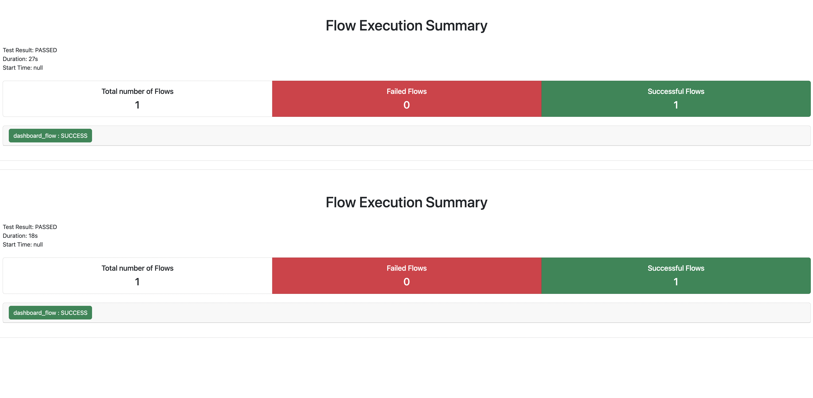

# Assignment

This repository demonstrates end-to-end (E2E) testing for a React Native app using the Maestro framework as part of an assignment.

As part of the delivery we:
- Document the steps in this README
- Perform exploratory testing to understand the app and its flows
- Implement flows and a Page Object Model
- Implement E2E tests
- Generate reports and screenshots for review


# Global prerequisites

- Maestro: [Getting started](https://docs.maestro.dev/) (verify with `maestro --version`)
- Java (per Maestro docs)
- Node.js 18+
- npm

## Install dependencies
Run `npm i`  
Run `npx pod-install`


# iOS Development Environment
- Ensure Xcode is installed and updated
- Verify iOS simulators are available (`xcrun simctl list devices`)
- Test app launch on an iOS simulator (`npm run ios`)

# Android Development Environment
- Install Android Studio with the Android SDK
- Create an Android Virtual Device
- Set up environment variables
- Test app launch on an Android emulator (`npm run android`)

# Devices used for testing
- Pixel 6 API 33
- iPhone 11 iOS 17 


# App Configuration
- App ID: `org.awesome.app` 
- App name: `AwesomeApp` 

# Exploratory testing

The app shows a mocked list of 100 cryptocurrencies to simulate a real user experience. It includes:
- A Side Menu with a "Get the ultimate answer" button
- A Dashboard with a scrolling list of 100 coins
- Settings with three filters: Only show "Bitcoin" coins, Only show winners, Only show losers
- Support for rotation

# Bugs

Title: "Good choice" message shown for a coin with negative profit
1. Launch the app
2. Go to Settings and select "Only show losers"
3. Go back to Dashboard
4. Tap a loser coin
5. Observe

Actual results: "Good choice" message  
Expected results: "Bad choice" message  


Title: Bitcoin SV tap triggers an uncaught error
1. Launch the app
2. On Dashboard, find "Bitcoin SV"
3. Tap it
4. Observe

Actual results: Uncaught error  
Expected results: "Bad choice" message  


# Scenarios

The following scenarios were identified during exploratory testing and implemented in flows.

**Side menu**
***Scenario 1:***
- Launch the app, open the Side Menu, and verify the text "Side menu" and the legend about "the Ultimate Question of Life...".
- Tap "Get the ultimate answer" and verify a popup with the value 42. Tap "OK".
- Tap the button again and confirm the value is still 42.

**Dashboard**
***Scenario 1:***
- Launch the app. Verify the tabs are visible and the Dashboard shows 100 coins in a scrollable list.
- Confirm the first item is Bitcoin with price $9228.8 and +0.93%.
- Tap it and confirm the popup message: "Good choice: Bitcoin @ $9228.8!".

**Settings**
***Scenario 1:***
- Launch the app, go to Settings. Verify "Application Settings" header is visible, and none of the checkboxes are selected.
- Verify the three options:
  - Only show "Bitcoin" coins
  - Only show winners
  - Only show losers

***Scenario 2:***
- Tap "Only show \"Bitcoin\" coins"
- Tap "Only show winners" and confirm a second check appears
- Tap "Only show losers" and confirm the "winners" check is cleared and "losers" is checked

***Scenario 3:***
- Tap "Only show winners" and confirm only one check
- Tap "Only show losers" and confirm the check moves from "winners" to "losers" (only one check at a time)


**Integration flow**
***Scenario 1:***
- Select Only show "Bitcoin" coins and return to Dashboard → see 5 coins

***Scenario 2:***
- Select Only show "Bitcoin" coins and Only show winners → see 4 coins

***Scenario 3:***
- Select Only show "Bitcoin" coins and Only show losers → see 1 coin

***Scenario 4:***
- Select "Only show winners" → see 73 coins

***Scenario 5:***
- Select "Only show losers" → see 27 coins


# Testing

Use Maestro to run E2E flows against a simulator/emulator.

You can run tests against a single device or use sharding to run on both devices.

For sharding:

```bash
npm run test:maestro:settings
npm run test:maestro:dashboard
npm run test:maestro:sidemenu
npm run test:maestro:integration
```

For single-device testing, see:
[Specify a Device - Maestro Documentation](https://docs.maestro.dev/advanced/specify-a-device)


# Selectors

On iOS the dashboard title used an `accessibilityLabel` and had no `accessibilityIdentifier`, so the visible text "100 coins" was not available for matching. Android exposes the visible text, so that check passed there. We added a stable test id (`testID="coins-balance"`) and set the iOS label to the dynamic value so both platforms can reliably assert the same thing.

# Notes


- Integration iOS and Android tests are split on purpose to show different approaches to test architecture
- We added pageObjects to centralize selectors. As a next step, consider adding common flows for reuse.


# Screenshots

Test scripts capture screenshots for visual validation. Find them under: /test-results/<suite>/screenshots/. On iOS, some dynamic selectors are unstable, so a few checks rely on screenshots rather than text assertions.

Each flow generates screenshots at key validation points:
- **Settings flow**: Screenshots of checkbox states and filter selections
- **Dashboard flow**: Screenshots of coin interactions and popup messages
- **Integration flow**: Screenshots of end-to-end user journeys


# Reports

HTML reports are generated automatically when running a suite, for example:


```bash
npm run test:maestro:integration
```

Open the report at:
`test-results/<suite>/report.html` (e.g., `test-results/integration/report.html`)
