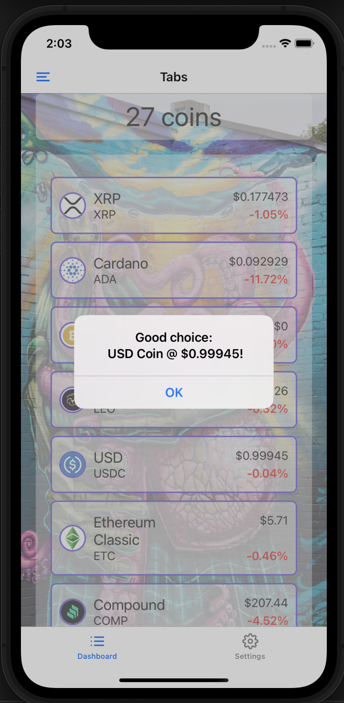
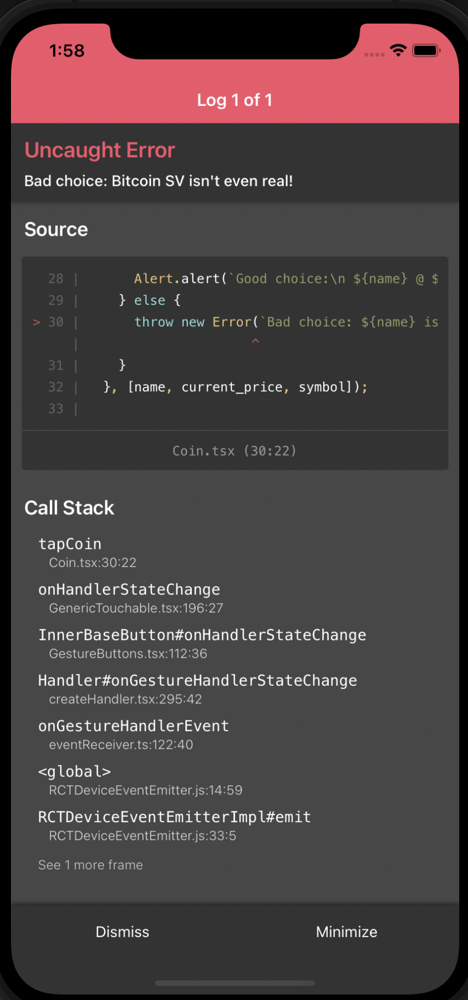

# Assignment

This is an E2E testing assignment to demonstrate QE skills. We will implement automated e2e tests for a mobile React Native app using Maestro testing framework.

As part of delivery we will do:
- README.md documentation which presents all steps done as part of assignment
- Do exploratory testing to understand application and possible flows
- Implement different flows and Page Object Model
- Implement E2E testing
- Prepare proper report to review results


# Global pre-requisites

-   Maestro: [Getting started](https://docs.maestro.dev/)
-   Install proper Java version (see Maestro documentation)
-   Ensure Node.js 18+ is installed
-   `npm`

## Install dependencies
Run `npm i`  
Run `npx pod-install`


# iOS Development Environment
- Ensure Xcode is installed and updated
- Verify iOS simulators are available (`xcrun simctl list devices`)
- Test app launch on iOS simulator (`npm run ios`)

# Android Development Environment
- Install Android Studio with Android SDK
- Create Android Virtual Device 
- Set up environment variables 
- Test app launch on Android emulator (`npm run android`)

# Devices used for testing
- Pixel 6 API 33
- iPhone 11 iOS 17 


# App Configuration
- App ID: `org.awesome.app` 
- App name: `AwesomeApp` 

# Exploratory testing

As part of doing exploratory testing we can come to conclusion that app represents list of cryptocurrency, which is mocked but simulates user perspective like that app could look like. In the app we have:
- Side Menu with "Get the ultimate answer" button
- Dashboard with scrolling list of cryptocurrency where you can view 100 coins, different currency items which are clickable 
- Application settings where we can filter Dashboard with currency based on three items: Only show "Bitcoin" coins, Only show winners, Only show losers
- App adjusts view to rotation

# Bugs
As part of exploratory testing we found that:

**Title:**  Good choice message is return on negative profit
1. Launch app
2. Go to Settings and select radio button "Only show losers"
3. Go back to Dashboard and select any losers 
4. Tap on it
5. Observe


**Actual results:**
Good choice message




**Expected results:** 
Bad choice message


**Title:** Bitcoin SV return Uncaught error
1. Launch app
2. You are on Dashboard page, look for Bitcoin SV
3. Tap on it
4. Observe


**Actual results:**
Bitcoin SV return Uncaught error



**Expected results:** 
Bad choice message

# Scenarios

As part of exploratory testing we did identify below scenarios which we plan to implement as part of our flows. 

**Side menu:**
***Scenario 1:*** 
- Launch the app, go to the Side menu and verify you see the text "Side menu" and the text "Legend says that if you click on the button...". Tap the button "Get the ultimate answer" and verify a popup appears with the value 42. Tap "OK". Tap the button again and confirm the value is 42. Leave the sidebar and come back a third time, tap the button again and confirm the answer is always 42.

NOTE: This scenario is not fully functional in automation tests.

**Dashboard:**
***Scenario 1:*** 
- Launch the app, confirm you see Tabs and 100 coins with scrolling list. Confirm that first item on the top of list is Bitcoin with value $9228.8 and +0.93%. Click on it and confirm you see pop up with information "Good choice: Bitcoin @ $9228.8!". 

**Settings:** 
***Scenario 1:*** 
- Launch the app, go to Settings by clicking Settings button. Confirm Application settings window appears. Confirm none of the buttons are selected and you see three  buttons called:
  - Only show "Bitcoin" coins
  - Only show winners
  - Only show losers

***Scenario 2:*** 
- Click on button with Bitcoin. Click on "Only show winners" and confirm now 2nd blue check appears. Click on "Only show losers" and confirm that 2nd blue check from "Only show winners" is no longer there and 3rd one appears under "Only show losers"

***Scenario 3:*** 
- Click on radio button "Only show winners" and confirm you see only one check done. Click on "Only show losers" and confirm that only new check appears and check from "Only show winners" is no longer there


**Integration flow:**
***Scenario 1:*** 
- Launch the app, go to settings and select "Only show Bitcoins" coins and come back to Dashboard, confirm you will see only 5 coins 

***Scenario 2:*** 
- Launch the app, go to settings and select "Only show Bitcoins" coins and "Only show winners" and come back to Dashboard, confirm you will see only 4 coins 

***Scenario 3:*** 
- Launch the app, go to settings and select "Only show Bitcoins" coins and "Only show losers" and come back to Dashboard, confirm you will see only 1 coin 

***Scenario 4:*** 
- Launch the app, go to settings and select "Only show winners" and come back to Dashboard, confirm you will see only 73 coins 

***Scenario 5:*** 
- Launch the app, go to settings and select "Only show losers" and come back to Dashboard, confirm you will see only 27 coins 


# Testing

Use Maestro to run end-to-end flows against the app running on a simulator.

You can run tests against a single device or use sharding to run on both devices.

For sharding, use the commands below:

```bash
npm run test:maestro:settings
npm run test:maestro:dashboard
npm run test:maestro:sidemenu
npm run test:maestro:integration
```

For single device testing, it is recommended to follow this guide:
[Specify a Device - Maestro Documentation](https://docs.maestro.dev/advanced/specify-a-device)


Note: Sidemenu test scenarios were not completed. During delivery, we had difficulty clicking the hamburger button because it lacked a proper ID, and tapping by screen coordinates proved unreliable. Since modifying the app was not part of the exercise, tests were created but they may fail due to the missing hamburger identifier.

Note: Test related to dashboard are split between iOS and Android as it was unsucesful to catch X coins value with iOS.


# Screenshots

As part of the delivery, we adjusted the commands in `package.json` to run tests with screenshot capture in order to validate visual aspects of the tests. Screenshots can be found under `/test-results/screenshots/`.  It was ass for iOS has not stable selectors which allow to extract some values.

Each test flow generates screenshots at key validation points:
- **Settings flow**: Screenshots of checkbox states and filter selections
- **Dashboard flow**: Screenshots of coin interactions and popup messages
- **Integration flow**: Screenshots of end-to-end user journeys


